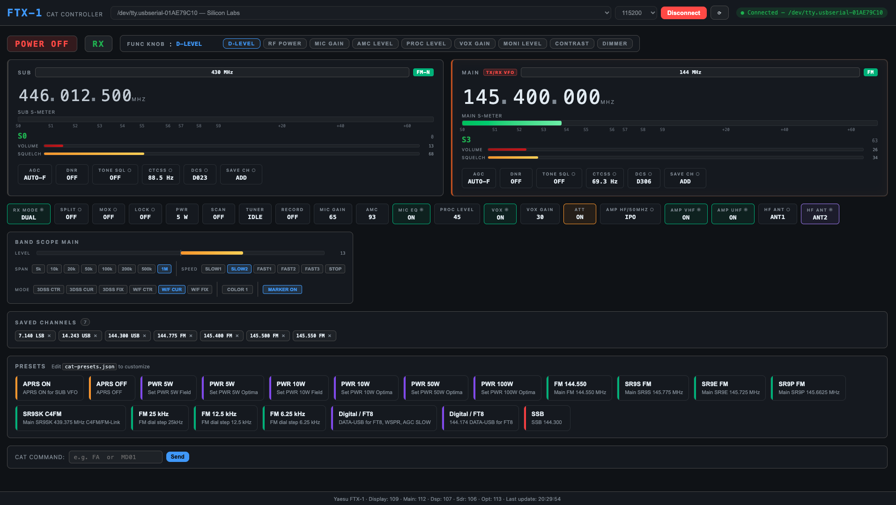
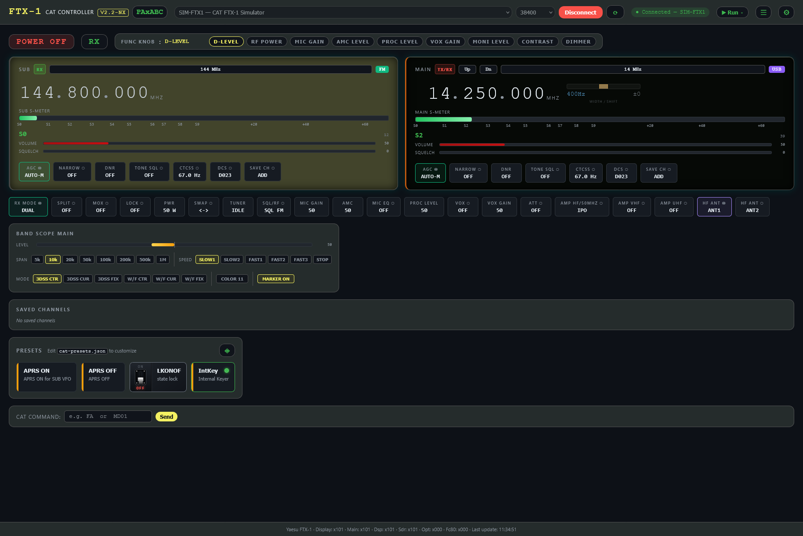
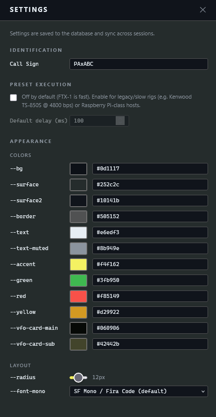
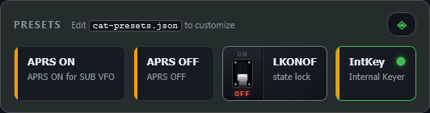
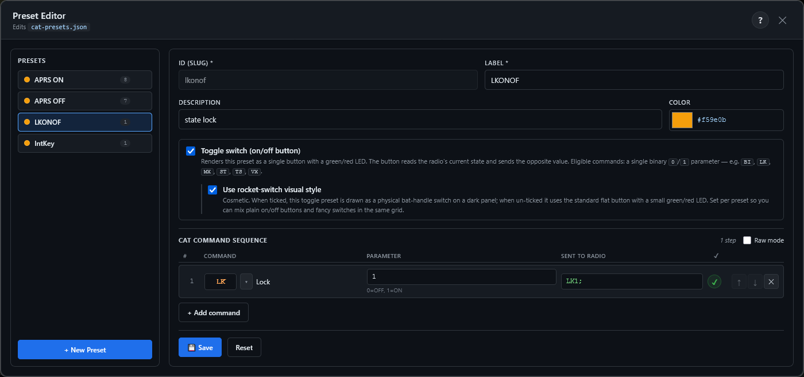
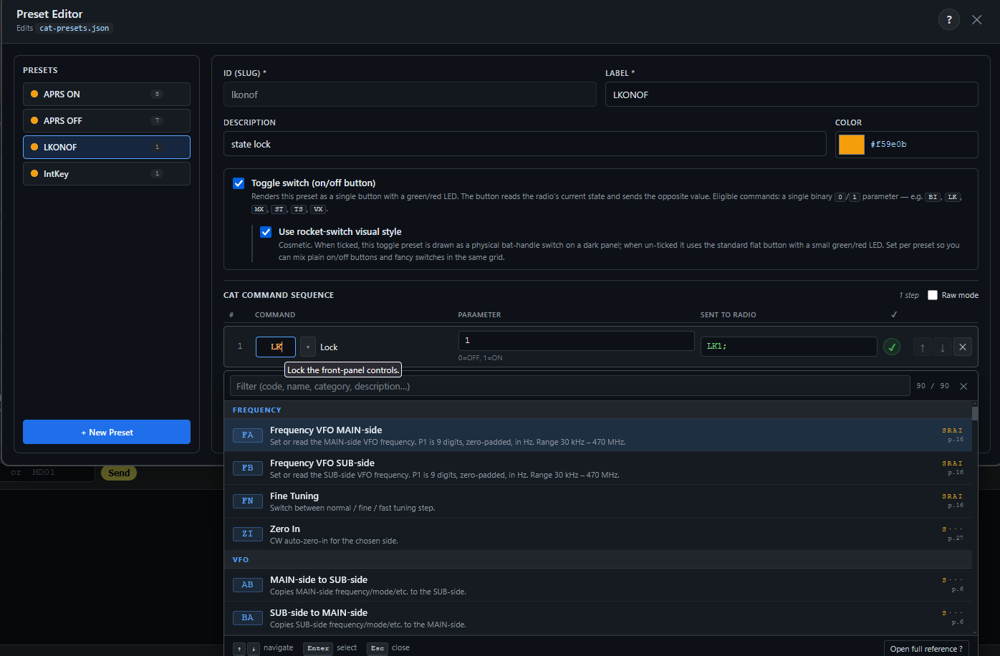
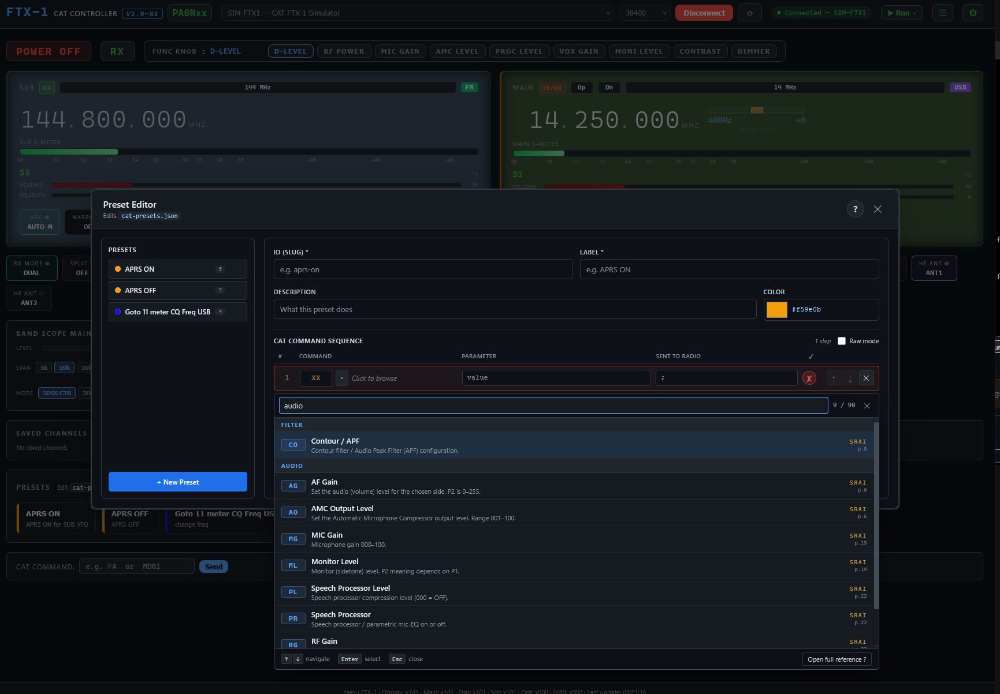
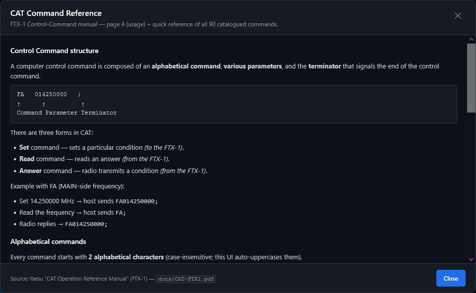
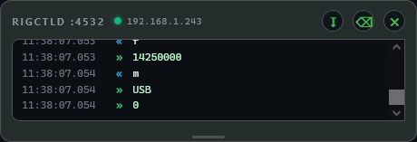
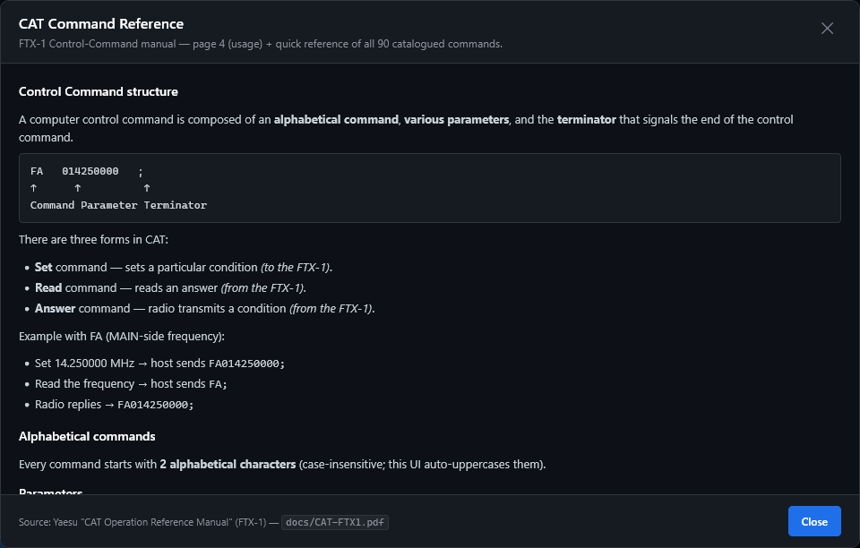

# cat-ftx1
CAT-Based Graphic Remote Control Software for Yaesu FTX-1.

A Node.js and browser-based application for control the Yaesu FTX-1 radio transceiver using the CAT (Computer Aided Transceiver) protocol over USB serial.

The solution is designed to make it easier to use the transceiver by eliminating the need to click through multiple menu options. 
The technology used allows the application to run on various operating systems including Windows, macOS, and Linux

The app works by establishing a connection and identifying the transceiver. Once the FTX-1 is detected, auto-information mode is activated, which sends all parameter changes to the app; these changes are then displayed graphically in the web browser.



### Establishing a Connection ###
The program works correctly on all three CAT interfaces provided by the transceiver.
However, please note the connection parameters defined in the FTX-1 configuration (Operation setting -> General -> CAT-1 rate, CAT-2 rate, CAT-3 rate) must corespond to values in the connection parameters on your computer.
Due to the large amount of data being transmitted, the best performance is achieved by setting the CAT port to 115200 bps in the transceiver\'s configuration.
If you want to use 115200 bps (what is recommeded), you need to firstly set it in FTX-1 Operation settings.
When using the SPA-1 (Optima) amplifier, the CAT-3 port is used for communication with the SPA-1, **do not change then** its parameters.

### Changes ###
- Added the ability to select the active VFO (by clicking the green RX button or the entire panel if inactive).
- Added UP and DN buttons for the active VFO (they function like microphone buttons).
- Added support for presentation and adjustment of received bandwidth, including support for +/- 1200 Hz offset. This feature is available only for Main VFO.
- Added quick switching of the Narrow option.
- Added reading configuration of the "SQL / RF / SQL only for FM" operating modes, combined with display rf gain and squelch sliders for both VFO.
- Added control of ATT, AMP and AGC mode switching.
- If an Optima amplifier is detected, the ability to select an antenna for HF has been added.
- Added functionality to remember the last selected port and baud rate.
- Added the ability to change numerical values using the mouse scroll wheel (frequency, DNR, PWR, MIC GAIN, AMC, PROC LEVEL and VOX GAIN).
- Added selectors for band, modulation mode, CTCSS and DCS tones.
- Adjustment of volume, squelch, and RF gain via mouse click.
- Added support for band scope settings with distinction between main and sub VFO.
- Added information about the transceiver firmware versions.

### Working with FTX-1 Memory ###
Currently, the program does not access the internal channels memory of the FTX-1 in any way.
The function for saving and recalling stored frequencies is handled by the program. When the “SAVE CH: Add” button is pressed, a **Save Channel** dialog opens where you can edit the label, frequency, and **MAIN/SUB** VFO before saving to browser local storage. Saved channels appear in the **Saved Channels** panel; click a channel to recall it on its stored VFO.

### General notes ###
The program is still in the early phase and may contain errors; it uses actual transceiver responses, which sometimes differ from those in the Yaesu CAT manual.
In some cases, the transceiver\'s responses are incorrect (e.g., setting the squelch on VFO Sub correctly sets the value, but the transceiver reports that the value for VFO Main has been changed).
The direction of the program\'s future development will depend on users feedback.

**Author:** SP9AX

---

## NX fork enhancements (`V2.2-NX`)

This repository is a maintained fork of the original [cat-ftx1](https://github.com/rzochowski/cat-ftx1) project by **SP9AX**. The base application behaviour described above is unchanged; the sections below summarise **additions and improvements** introduced in the **NX** line by **Max Elevation**.

| | |
|---|---|
| **Fork maintainer** | **Max Elevation** |
| **Fork repository** | https://github.com/phrancky5/cat-ftx1 |
| **Build label** | `V2.2-NX` (shown in the application header) |
| **Detailed change log** | [`changelog.md`](changelog.md) — dated entries for every batch |
| **Implementation notes** | [`cat-ftx1-NXC.md`](cat-ftx1-NXC.md) — long-form design narrative (§§ 1–25) |
| **Hamlib / rigctld decision** | [`Hamlib-Research.md`](Hamlib-Research.md) — why we expose `rigctld` without bundling Hamlib |
| **Screenshots** | [`docs/`](docs/) — UI captures and reference images (listed below) |

### Screenshots (`docs/`)

Images below use paths relative to this repository so they display on GitHub and in local Markdown viewers. The Yaesu CAT manual PDF is also in `docs/` for the Preset Builder catalogue.

#### Main interface

| | |
|---|---|
| Original author UI (reference) | NX fork main page (`V2.2-NX`) — saved channels, band meter labels, settings |
|  |  |

#### Appearance and presets

| Feature | Screenshot |
|---|---|
| Appearance / theme settings |  |
| Presets on the main page |  |
| Preset editor |  |
| Category-browsing command picker |  |
| Command catalogue / help reference |  |
| CAT command quick reference |  |

#### `rigctld` relay and reference

| Feature | Screenshot |
|---|---|
| Live **rigctld :4532** terminal panel (next to Band Scope) |  |
| CAT protocol reference card |  |

#### Manual (not a screenshot)

- [`docs/CAT-FTX1.pdf`](docs/CAT-FTX1.pdf) — Yaesu FTX-1 CAT manual (source for the 90-command catalogue in the Preset Builder)

### Security and deployment

- **Phase 0 security hardening** — serial-server bound to loopback, per-launch Bearer token on the HTTP API, DNS-rebinding host check, SSE proxied through Nuxt so tokens never reach the browser.
- **LAN access with IP allowlist** — optional exposure on the LAN; every HTTP request is gated by `ALLOWED_IPS` (comma-separated IPs/CIDRs; default loopback only). Same variable gates the `rigctld` TCP relay (see below).
- **Electron packaging path** — desktop build via `electron/` + `electron-builder.yml` (see project docs for build steps).

### User interface and settings

- **Appearance settings drawer** — customise colours, fonts, and corner radius; changes apply live.
- **Theme persistence in SQLite** — appearance overrides survive browser cache clears (`settings.theme_overrides` in the database, with `localStorage` as a fast shadow).
- **Settings API fix** — call sign and theme saves no longer fail with HTTP 500 (SQLite `datetime('now')` quoting corrected).
- **Header version label** — fork build shown as `V2.2-NX` next to “CAT CONTROLLER” (single source: `runtimeConfig.public.appVersion` in `nuxt.config.ts`).
- **Settings hex colour entry** — type `#RRGGBB` directly in the appearance drawer (draft-on-focus; no revert while typing).
- **VFO frequency font** — Settings → **Layout → `--font-vfo`**; default **AutopromPro Black Rounded** (Yaesu-style MHz readout, loaded from CDN — not bundled in repo); UI monospace remains on `--font-mono`.
- **Status badge robustness** — boolean props coerced correctly when the radio reports `0`/`1` numeric flags.

### Saved channels (browser localStorage)

- **Save Channel modal** — **SAVE CH → ADD** on MAIN or SUB opens a dialog with editable **label**, **frequency (MHz)**, and **MAIN/SUB** toggle (starts on the VFO you saved from).
- **Channel cards** — label and MHz editable inline; **MAIN/SUB** badge; mode and tone summary; click card to recall on the **stored VFO** (not TX VFO).
- **Persistence** — `cat-channels.json` in the project root (same model as presets); survives browser cache clears. One-time import from legacy `localStorage` on first load if the file is empty.

### Band selector

- **Meter band names** in the band picker (e.g. **40m** / 7 MHz, **2m** / 144 MHz) and compact meter label on the VFO band button.
- **Frequency follows band change** — after **BS**, serial-server re-reads **FA**/**FB** so the MHz display updates (simulator included via `band-defaults.mjs`).

### Presets (JSON workflow)

Presets remain in **`cat-presets.json`** (not the dormant DB preset tables). The Preset Manager opens from the **Presets** header (◈ button).

- **Preset Builder rewrite** — clean modal UI for creating, editing, and deleting presets; list-first workflow when opening the manager.
- **90-command CAT catalogue** — authoritative command list parsed from `docs/CAT-FTX1.pdf`, with descriptions and parameter rules in `components/cat-commands-ftx1.ts`.
- **Smart parameter validation** — warns on questionable values; **blocks Save** on hard validation errors.
- **Command help (`?`)** — modal with manual page-4 usage notes and a sortable/filterable quick-reference table.
- **Category-browsing command picker** — replaces the narrow browser `<datalist>`; browse commands by category in a wide, viewport-anchored panel (keyboard: ↑↓, Enter, Esc; auto-flips when near screen edges).
- **Binary toggle-switch presets** — for on/off CAT commands (e.g. **BI** Break-In, **TS** TX Watch, **LK**, **MX**, **ST**, **VX**): optional `toggle: true` turns the preset button into a stateful switch with a **green/red LED** that tracks the radio via SSE (including changes made on the front panel).
- **Rocket-launch toggle visual (opt-in)** — per preset, `toggleSwitch: true` renders a bat-handle switch on a dark panel instead of the flat button + LED.
- **Optional step timing (Settings → Preset execution)** — off by default for FTX-1. When enabled, Preset Builder exposes per-step **Delay (ms)** and **Await**; saved presets may use `{ "command": "…", "delayMs": 150, "await": true }` objects for slow legacy rigs (e.g. Kenwood TS-850S @ 4800 bps) or Raspberry Pi-class hosts.

### Macros (legacy — UI hidden)

The SQLite macro system and `/api/macros*` endpoints remain in the codebase, but the **Macro Builder**, quick-run dropdown, and ☰ header button are **hidden** in this fork — **JSON presets** are the primary workflow. To re-enable the macro UI for development, set `SHOW_MACRO_UI = true` in `pages/index.vue`.

### Band scope and CAT bridge

- **Band scope level display fix** — LEVEL bar visual alignment corrected.
- **Manual CAT command** — type commands at the bottom of the main page; optional await for the radio reply.
- **Extended serial-server state** — additional FTX-1 parameters tracked for SSE (e.g. **BI**, **TS**, band scope sub-fields) so the UI and toggles stay in sync without per-click polling.
- **In-process radio simulator** — optional `SIMULATE_RIG=1` adds a virtual `SIM-FTX1` port for development without hardware.

### `rigctld` TCP relay (external app integration)

Run **WSJT-X**, **Fldigi**, **JS8Call**, **Gpredict**, **N1MM**, **CQRLOG**, and other Hamlib-aware programs **alongside** this app on the **same** radio connection — without a second serial port or a bundled Hamlib install.

| Item | Detail |
|---|---|
| **Protocol** | Subset of Hamlib `rigctld` text protocol on TCP **port 4532** (default) |
| **Implementation** | `rigctld-relay.mjs` inside `serial-server.mjs` |
| **Virtual split** | Software-only split (no hardware `ST1`) — compatible with satellite/Doppler workflows; matches Hamlib FTX-1 backend behaviour |
| **Security** | Each TCP connection checked against `ALLOWED_IPS` before any data is exchanged |
| **Live terminal panel** | When a client connects, a **rigctld :4532** panel appears next to **Band Scope** showing colour-coded RX/TX traffic, client IP(s), auto-scroll, and a resizable log area |

**WSJT-X quick setup:** *Settings → Radio → Rig: **Hamlib NET rigctl** → Network Server: `127.0.0.1:4532` → PTT Method: **CAT** → Split Operation: **Rig**.*

Environment variables (serial-server):

| Variable | Default | Purpose |
|---|---|---|
| `RIGCTLD_ENABLE` | `1` | Set `0` to disable the relay |
| `RIGCTLD_PORT` | `4532` | TCP port |
| `RIGCTLD_HOST` | `0.0.0.0` | Bind address (`127.0.0.1` to refuse non-loopback at OS level) |
| `RIGCTLD_DEBUG` | `0` | Set `1` to log every line in the serial-server console |
| `ALLOWED_IPS` | `127.0.0.1/8,::1` | Shared with the HTTP API allowlist |

### Documentation shipped with this fork

| File | Contents |
|---|---|
| [`changelog.md`](changelog.md) | Chronological list of all NX changes |
| [`cat-ftx1-NXC.md`](cat-ftx1-NXC.md) | Session change log with verification checklists |
| [`SECURITY-AUDIT.md`](SECURITY-AUDIT.md) | Security review and threat model |
| [`Hamlib-Research.md`](Hamlib-Research.md) | Hamlib integration assessment + rigctld smoke-test notes |
| [`docs/INSTALLATION.md`](docs/INSTALLATION.md) | **Installation guide** — prerequisites, `npm install`, database, ports, troubleshooting |

### Fork maintainer

**NX fork:** **Max Elevation** — based on the original work by **SP9AX**.  
GitHub: https://github.com/phrancky5/cat-ftx1

For the complete per-feature history, start with [`changelog.md`](changelog.md) (newest entries first) or [`cat-ftx1-NXC.md`](cat-ftx1-NXC.md) §§ 9–25 for the follow-on batches after the initial security hardening.

### Keeping another PC in sync

After the first `git clone`, use **`git pull`** on each machine before you start work:

```powershell
cd cat-ftx1
git pull
```

If `package-lock.json` changed, run `npm install` (and `npm rebuild better-sqlite3` on Windows if the native module fails to load). If the changelog mentions a SQL migration, apply it once per existing database:

```powershell
sqlite3 data/cat-ftx1.db ".read sql/migrate-add-preset-timing-settings.sql"
```

Then restart `serial-server.mjs` and `npm run dev`. Commit and push from the machine where you made changes; pull on the others — standard Git workflow, no special sync tool required.

**Without Git** (USB stick, LAN share, etc.), run from the project folder:

```powershell
copy-project.bat D:\Target\cat-ftx1
```

That copies all source files and folder structure, excluding `node_modules`, build output, `.git`, and local `data\`. Run `npm install` on the destination PC.

### Port errors on startup (Windows)

If you see **`EACCES: permission denied 127.0.0.1:3001`** or Nuxt picks a port other than 3000:

1. **Check Windows excluded ports** (Hyper-V / Docker often block 3000–3001):
   ```powershell
   netsh interface ipv4 show excludedportrange protocol=tcp
   ```
2. **Recent builds auto-probe** — `serial-server.mjs` tries 3001, then 3002… up to 3026 and writes the chosen port for Nuxt to find.
3. **Or set ports explicitly** — copy `.env.example` to `.env`:
   ```powershell
   SERIAL_SERVER_PORT=3101
   PORT=3080
   ```
4. **Open the URL Nuxt prints** — if it says `Using alternative port 3080`, browse `http://localhost:3080` (not 3000).
